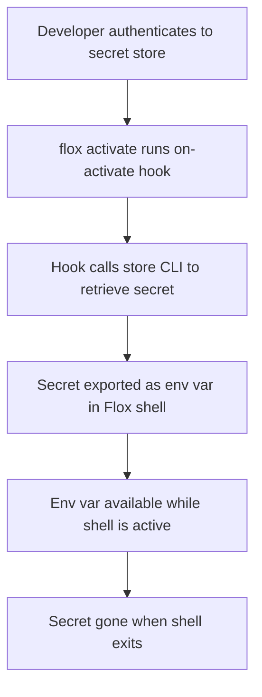

# Secrets management

A common need is to authenticate a Flox environment to external
services—for example, a GitHub account or a database password inside a
project environment.

Secrets should never be hardcoded in a `manifest.toml` file.
Hard-coded secrets could end up committed to git, visible in shell history,
and cannot be rotated without editing the manifest.
Dotenv files have similar issues.

A secure pattern is to keep secrets in a secret store and retrieve them
just-in-time during `flox activate`,
exporting them as environment variables that live only while the
environment is active.

## The JIT secrets pattern



The pattern has three phases:

### 1. Primary auth (once per session)

A human authenticates once to a secret store using a primary credential
(biometric, SSO session, password, etc.).
This grants a session or token that the retrieval step will use.
This is the human-in-the-loop gate—it makes secret access auditable
and revocable.

### 2. Secret retrieval (`on-activate`)

The `on-activate` hook in `.flox/env/manifest.toml` calls the secret
store's CLI or API to retrieve specific secrets at shell activation time.
The store validates the active session before returning values.

See [Activating environments](activation.md) for more about hooks.

### 3. Scoped env var injection

Retrieved secrets are exported as environment variables.
They exist only in the active Flox shell process and are gone when the
shell exits.
They never touch disk.

## Key security properties

- **Not in manifest** — secret values are never written to `manifest.toml`
- **Not committed to git** — the manifest is safe to commit; it contains
  only retrieval instructions, not values
- **Not in dotenv files** — no `.env` file to accidentally expose
- **Not in shell history** — the `on-activate` hook runs non-interactively
- **Auditable** — the secret store logs each access
- **Rotatable** — update the value in the store; the manifest never changes
- **Scoped** — credentials are per-environment, not global

## Implementation examples

### macOS Keychain

Store the token once:

```bash
security add-generic-password -a "$USER" -s "github-work-token" -w "ghp_yourtoken"
```

Retrieve in `on-activate`:

```toml
[hook]
on-activate = '''
  export GH_TOKEN=$(security find-generic-password -a "$USER" -s "github-work-token" -w)
'''
```

!!! note
    macOS shows a Keychain access dialog on first use.
    Clicking **Always Allow** makes subsequent activations silent.
    In non-interactive contexts (CI, SSH without a GUI agent) the dialog
    cannot appear and the command will fail—use a CI-native secret
    mechanism instead.

!!! note
    `security` is installed by default at `/usr/bin/security` on all macOS
    versions. No Xcode or Homebrew required.

### 1Password

```toml
[hook]
on-activate = '''
  export GH_TOKEN=$(op read "op://Personal/GitHub Work Token/credential")
'''
```

Requires `op` CLI and an active `op signin` session.
`flox install _1password` to add the CLI to your environment.

See the [Flox + 1Password blog post](https://flox.dev/popular-packages/adding-1password-secrets-to-flox-environments/)
for a more detailed walkthrough including fewer interactive logins.

### HashiCorp Vault

```toml
[hook]
on-activate = '''
  export GH_TOKEN=$(vault kv get -field=token secret/github-work)
'''
```

Requires the `vault` CLI and an active `vault login` session.
`flox install vault` to add the CLI to your environment.

### AWS Secrets Manager

```toml
[hook]
on-activate = '''
  export GH_TOKEN=$(aws secretsmanager get-secret-value \
    --secret-id github-work-token \
    --query SecretString \
    --output text)
'''
```

Requires the `aws` CLI and an active `aws sso login` session.
`flox install awscli2` to add the CLI to your environment.

### Cross-platform (macOS + Linux)

Cross-platform secret stores like 1Password, HashiCorp Vault, and AWS
Secrets Manager work the same on macOS and Linux—no conditional needed.

A conditional is only necessary when different tools are used on each
platform, such as macOS Keychain on macOS and `pass` on Linux:

```toml
[hook]
on-activate = '''
  if [[ "$OSTYPE" == "darwin"* ]]; then
    export GH_TOKEN=$(security find-generic-password -a "$USER" -s "github-work-token" -w)
  else
    export GH_TOKEN=$(pass show github/work-token)
  fi
'''
```

The Linux side of this example uses [`pass`](https://www.passwordstore.org/),
which stores secrets in GPG-encrypted files.
`flox install pass`, `flox install pinentry-tty`, and `flox install gnupg`
to add the required packages to your environment.

## Rotating a secret

Because the value lives in the store, not the manifest, rotation requires
no manifest changes:

1. Generate a new secret at the issuer.
2. Update the secret store.

The next `flox activate` automatically uses the new value.
No PR, no teammate notification, no dotenv sync required.

!!! warning
    If a Flox shell is already active when rotation happens, the old value
    remains set in that running shell.
    The new value takes effect on the next `flox activate`.
    If rotation is in response to a credential compromise, kill active
    shells explicitly.

Finally, revoke the old token at the issuer once no more environments are
active with the old secret value.

## Secret store reference

| Store | Primary auth | Retrieval command |
|---|---|---|
| macOS Keychain | Login session / biometric | `security find-generic-password -a "$USER" -s "name" -w` |
| Linux keyring | Desktop session | `secret-tool lookup service name account user` |
| 1Password | `op signin` / biometric | `op read op://vault/item/field` |
| HashiCorp Vault | `vault login` (OIDC/LDAP/token) | `vault kv get -field=value secret/path` |
| AWS Secrets Manager | `aws sso login` | `aws secretsmanager get-secret-value --secret-id name --query SecretString --output text` |
| Doppler | `doppler login` | `doppler secrets get NAME --plain` |
| Pass | GPG key unlock | `pass show service/credential` |

## Further reading

- [Cross-platform secrets blog post](https://flox.dev/blog/get-your-preferred-secrets-manager-in-a-portable-cross-platform-cli-toolkit/)
- [Flox and AWS secrets management](https://flox.dev/blog/flox-and-aws-taking-the-chaos-out-of-secrets-management/)
- [Flox + 1Password](https://flox.dev/popular-packages/adding-1password-secrets-to-flox-environments/)
- [`manifest.toml` reference](../man/manifest.toml.md) — `[hook]` section
- [Activating environments](activation.md) — how hooks work
