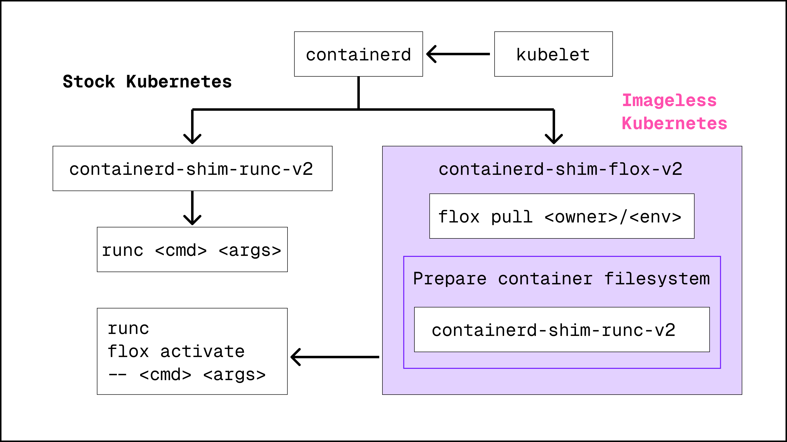

# How it works

Flox is a language-agnostic package and environment manager built on [Nix][nix].
Every environment produces a lockfile when built, so anyone using Flox can reproduce the exact same set of packages.
This makes Flox environments a natural fit for containers: the same environment works on your machine, in CI, and inside a container.

There are two fundamentally different ways to get a Flox environment into a container, and the choice determines how the container behaves at runtime.

## The thin-container model

Thin containers resolve Flox environments **at container startup** rather than baking dependencies into the image at build time.
This is the model used by both [Thin Containers](thin-containers/intro.md) (Docker/Podman) and [Imageless Kubernetes](imageless-kubernetes/intro.md).

### The `flox/empty` base image

Both approaches use a minimal base image that contains just enough to bootstrap Flox.
The [`flox/empty`][flox-empty] image on Docker Hub is only a few bytes --- it exists primarily to satisfy the container runtime's requirement for an image reference.
The actual packages come from the Nix store, not the image.

### The Nix store volume

Packages are stored in a persistent volume mounted at `/nix` inside the container.
For Docker and Podman, this is a named volume (e.g., `flox-store:/nix`) that persists across container runs.

The first time you run a container with a given environment, Flox populates the Nix store with the required packages.
This takes 30--60 seconds depending on the environment size.
On subsequent runs, the packages are already cached in the volume, so startup drops to roughly 5 seconds.

Because the Nix store is content-addressed, packages shared between different environments are stored only once.
Running `flox/redis` and `flox/python-pip` on the same host shares common dependencies automatically.

### Environment resolution

At container startup, Flox resolves the environment definition:

- **Remote environments**: pulled from FloxHub using the environment reference (e.g., `flox/redis`)
- **Local environments**: read from a `.flox/` directory mounted into the container

Once resolved, Flox activates the environment inside the container, making all declared packages, environment variables, and hook scripts available.

### Docker and Podman

For Docker and Podman, the container image's entrypoint handles the full lifecycle:

1. Start the Nix daemon (required for store operations inside the container)
2. Resolve the Flox environment from FloxHub or a local `.flox/` directory
3. Run `flox activate` to configure the shell with all packages and variables
4. Execute the user's command (or drop into an interactive shell)

The `flox activate --sandbox` flag wraps this Docker machinery behind a single CLI flag, automatically handling volume mounts, TTY detection, and argument forwarding.

### Kubernetes (containerd shim) {: #containerd-shim }

For Kubernetes, the [`containerd-shim-flox-v2`][shim-repo] intercepts the container configuration before `runc` creates the container.

The shim:

1. Reads the Flox environment reference from pod annotations
2. Pulls the environment to the node so it can be mounted into the container
3. Modifies the container's command to run inside the Flox environment
4. Passes the modified configuration to `runc`

This is transparent to the pod spec author --- they specify a Flox environment in an annotation and a command to run, and the shim handles the rest.

## The traditional model: `flox containerize`

[`flox containerize`][containerize-man] takes a fundamentally different approach.
It bundles **all** packages and dependencies into a self-contained OCI image at build time.
The resulting image does not use Flox or the Nix store at runtime --- it behaves like any conventional container image.

This means the image must be rebuilt every time the environment changes, and there is no shared caching between environments.
However, the images are fully pinned and deterministic, producing better results than hand-written Dockerfiles.

Use `flox containerize` only when deploying to infrastructure that requires standard container images and cannot support the thin-container model.
For all other cases, [Thin Containers](thin-containers/intro.md) or [Imageless Kubernetes](imageless-kubernetes/intro.md) provide significant advantages:

- **No image rebuilds** --- environment changes take effect on the next container start
- **Shared caching** --- the Nix store volume is shared across all environments on a host
- **Faster iteration** --- ~5 second startup after the first run
- **Centralized management** --- environments are managed via FloxHub, not frozen in an image
- **Smaller footprint** --- the base image is tiny; packages come from the shared store

[nix]: https://nix.dev/
[flox-empty]: https://hub.docker.com/r/flox/empty
[shim-repo]: https://github.com/flox/containerd-shim-flox
[containerize-man]: ../man/flox-containerize.md
