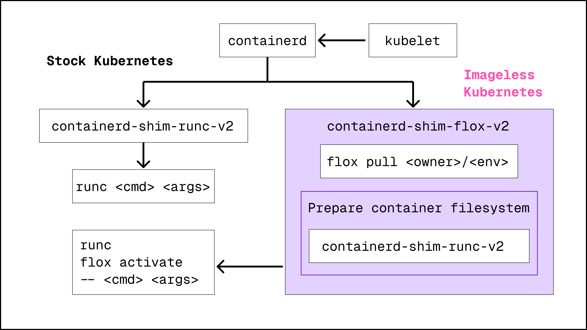

# The Tech Behind Imageless Kubernetes

Flox is a next-generation, language-agnostic package and environment manager.
With it you define "environments" that contain packages, environment variables, setup scripts, services, and more.
Every environment produces a lockfile when built so that anyone using Flox can reproduce the environment.
This means that the same environment works on your machine, your coworker's machine, in CI, and in production.

From a user's perspective, activating a Flox environment places the user into a shell that contains all of the packages, variables, etc defined in their environment.
Contrast this with a container that contains a filesystem image that has been imperatively built via a Dockerfile or some other means.

With Imageless Kubernetes you deploy pods that run commands inside of a Flox environment rather than a container instantiated from a container image.

## containerd-shim

Under the hood Imageless Kubernetes works by wrapping `containerd-shim-runc-v2` to make Flox-specific modifications to the container config and filesystem, but ultimately lean on battle-tested technology like `containerd-shim-runc-v2`.
The diagram below shows the high level overview of how Imageless Kubernetes works.

Typically `containerd` produces a `config.json` describing the container's namespace requirements, mount points, etc.
This `config.json` is provided to a `containerd-shim` that then calls `runc` in order to create the container.
`runc` then creates and starts the container using the information in `config.json`.

With Imageless Kubernetes the `containerd-shim-flox-v2` intercepts the container configuration to prepare the container with everything needed to run the Flox environment.
The shim performs a number of operations to prepare the container's filesystem, including pulling the specified Flox environment to the node so that it can be mounted into the container.

The shim also modifies the container's command to run it in the context of the Flox environment rather than running the command directly.
